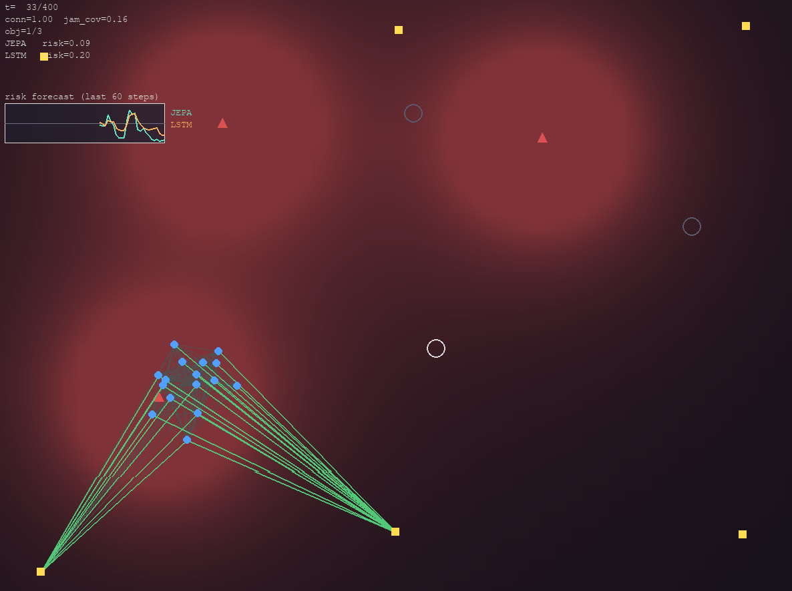
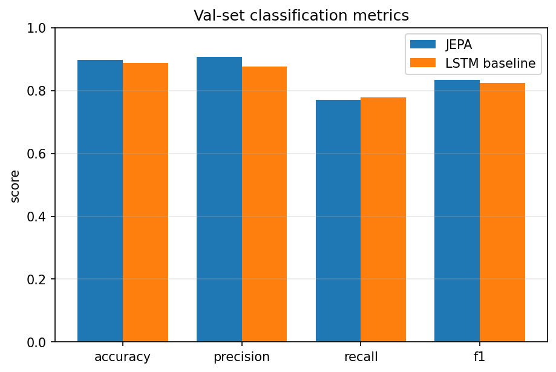

# MindSwarm JEPA

MindSwarm is a research prototype exploring whether JEPA-style latent future prediction can improve early warning of network fragmentation in simulated multi-agent coordination environments.

The environment models agents, relay nodes, abstract signal disruption, delayed observations, and communication-graph failure. The goal is to compare a JEPA-style future-latent predictor against a direct LSTM sequence-classifier baseline.

This prototype was developed as part of a QMIND Research Project Manager application/proposal.



## Research Question

Can a JEPA-inspired world model predict future network fragmentation earlier or more reliably than a standard recurrent classifier?

## Why JEPA?

Instead of directly predicting only a failure label, the JEPA-style model learns to predict a future latent representation of the system state. A small risk head then uses that predicted future representation to estimate whether failure is likely.

## Preliminary Results

The dataset was generated from 500 simulator episodes with an overall future-failure label rate of 32.53%. The train split contained 47,600 samples with a 32.30% failure rate, and the validation split contained 11,900 samples with a 33.45% failure rate.

The majority-class validation baseline is 66.55%, so the task is non-trivial.

| Model | Accuracy | Precision | Recall | F1 | ECE |
|---|---:|---:|---:|---:|---:|
| JEPA-style model | 0.8968 | 0.9073 | 0.7701 | 0.8331 | 0.0260 |
| LSTM baseline | 0.8886 | 0.8753 | 0.7776 | 0.8236 | 0.0134 |



The JEPA-style model outperformed the LSTM baseline on accuracy, precision, and F1, while the LSTM baseline had slightly better recall and calibration. The JEPA model also achieved a latent future-prediction MSE of 0.0290.

These results are preliminary, but they show that the JEPA-style future-latent prediction objective is competitive with, and slightly stronger than, a direct recurrent classifier on this simulated early-warning task.

## System Overview

1. `simulate.py` runs the multi-agent simulator and visualization.
2. `network.py` computes communication graph connectivity and disruption.
3. `generate_dataset.py` creates train/validation datasets from simulated episodes.
4. `models.py` defines the JEPA-style model and LSTM baseline.
5. `train_jepa.py` trains the latent future predictor.
6. `train_baseline.py` trains the direct LSTM baseline.
7. `evaluate.py` compares both models.
8. `demo.py` runs the live visual demo.

## Quick Start

```bash
python generate_dataset.py --n-episodes 100
python train_jepa.py --epochs 5
python train_baseline.py --epochs 5
python evaluate.py
python demo.py
```

## Full Run

```bash
python generate_dataset.py
python train_jepa.py
python train_baseline.py
python evaluate.py
python demo.py
```

## Current Status

This is an early proof of concept, not a deployable robotics system. The current simulator is intentionally simplified so the project can focus on the world-modeling question.

## Long-Term Roadmap

- Improve simulator realism and scenario diversity.
- Add stronger baselines and ablation studies.
- Test whether JEPA improves early-warning lead time.
- Move from state-vector inputs to visual/frame-based JEPA.
- Port the environment toward PyBullet drones or Isaac Sim for higher-fidelity robotics simulation.

## Limitations

- This is JEPA-inspired, not a full implementation of Meta's V-JEPA.
- The simulator is abstract and simplified.
- Results should be interpreted as prototype evidence, not real-world deployment performance.
